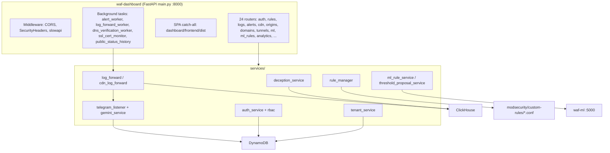

# บทที่ 08 — ภาพรวม Backend

## 8.1 บทบาท

Backend คือแอป **FastAPI** ไฟล์ `dashboard/backend/main.py` รันเป็น systemd service `waf-dashboard` ฟังที่ `0.0.0.0:8000` ทำหน้าที่ 4 อย่าง:

1. **REST API** ของ dashboard ทั้งหมด (`/api/...`)
2. **เสิร์ฟหน้าเว็บ React** ที่ build แล้วจาก `dashboard/frontend/dist` (mount `/assets` + route catch-all คืน `index.html`)
3. **Background workers** ที่เริ่มตอน startup
4. **Internal endpoints** ที่ nginx เรียก เช่น `/api/limiter/check`, `/api/deception/respond`, `/api/domains/check-ssl-allowed`

*รูปที่ 6 — องค์ประกอบของ backend*

## 8.2 Middleware

| Middleware | หน้าที่ | ไฟล์ |
|---|---|---|
| `CORSMiddleware` | อนุญาต origin ตามรายการ `ALLOWED_ORIGINS` | `main.py` |
| `SecurityHeadersMiddleware` | ใส่ HSTS, `X-Content-Type-Options: nosniff`, `X-Frame-Options: DENY`, `Referrer-Policy` | `main.py` |
| slowapi `Limiter` | จำกัดอัตรา เช่น `/api/auth/login` 5 ครั้ง/นาที | `main.py`, `api/auth.py` |

## 8.3 Background workers (เริ่มใน `@app.on_event("startup")`)

| Task | หน้าที่ | สถานะ |
|---|---|---|
| `alert_worker` | loop ของระบบ alert/Telegram | VERIFIED |
| `log_forward_worker` | tail `logs/nginx/access.json` + ModSecurity audit → normalize → ClickHouse/DynamoDB → alert | VERIFIED |
| `_cleanup_expired_codes` | ลบรหัสยืนยันที่หมดอายุ | VERIFIED |
| `dns_verification_worker` | ตรวจ DNS ของโดเมนที่ยังไม่ verified เป็นระยะ | VERIFIED |
| `ssl_cert_monitor_worker` | ตรวจสถานะใบรับรองของแต่ละโดเมน | VERIFIED |
| `public_status_history_worker` | เก็บประวัติสถานะ edge ทุก 5 นาทีสำหรับหน้า `/status` | VERIFIED |

## 8.4 บริการที่ backend พึ่งพา

| บริการ | วิธีเชื่อม | ถ้าล่มจะเกิดอะไร |
|---|---|---|
| ClickHouse | clickhouse-connect (`services/clickhouse_service.py`) | หน้า log/analytics ว่าง, การบันทึก log ล้มเหลว (ไม่ทำให้ API ล่ม) |
| DynamoDB | boto3 | login และข้อมูล origin/alert ใช้ไม่ได้ |
| Redis | redis-py | challenge/rate limit บางส่วนทำงานไม่ได้ |
| waf-ml | HTTP `127.0.0.1:5000` | หน้า ML และ rule generation ใช้ไม่ได้ |
| Gemini, Telegram | HTTPS | สรุป alert ด้วย AI / การแจ้งเตือนหาย แต่ alert ยังถูกบันทึก |

## 8.5 ข้อควรระวังที่พบจริง

- โค้ดบางส่วนเรียก boto3 แบบ synchronous ภายใน async handler ซึ่งบล็อก event loop ได้ — พบและแก้ใน `dispatch_telegram_alert` (commit `b8dd3f0`) ใช้ `asyncio.to_thread`
- CI (`.github/workflows/ci.yml`) ตั้งให้ทำงานกับ branch `main`, `develop`, `backend` (ตัวพิมพ์เล็ก) ส่วน branch ที่ใช้จริงคือ `Backend` จึงอาจไม่ถูกตรวจ → **PARTIAL**

## แหล่งอ้างอิง (Evidence)
- `dashboard/backend/main.py` (บรรทัด 44–90, 255–300), `services/*.py`
- `systemctl show waf-dashboard`, `.github/workflows/ci.yml`
