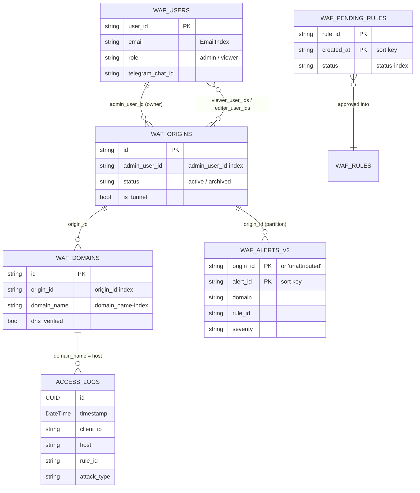

# บทที่ 13 — ฐานข้อมูล (Database)

ระบบใช้ฐานข้อมูล 4 ชนิด แต่ละชนิดเลือกตามลักษณะข้อมูล: log จำนวนมากเข้า ClickHouse, ข้อมูลธุรกิจเข้า DynamoDB, สถานะชั่วคราวเข้า Redis, การตั้งค่าที่ nginx ต้องอ่านเร็วเข้า SQLite

*รูปที่ 8 — ความสัมพันธ์ของข้อมูลหลัก (ER)*

## 13.1 ClickHouse (container `waf-clickhouse`)

| ตาราง | Engine / Order | อายุข้อมูล | ใช้ทำอะไร |
|---|---|---|---|
| `default.access_logs` | MergeTree, `ORDER BY (timestamp, client_ip)` | TTL 30 วัน (`ACCESS_LOGS_RETENTION_DAYS`) | log ทุกคำขอจาก Main และ edge |
| `default.security_audit_logs` | MergeTree, `ORDER BY (timestamp, rule_id)` | ไม่พบ TTL | audit ของ deception |

คอลัมน์ `access_logs`: `id UUID`, `timestamp DateTime`, `client_ip`, `method`, `url`, `status_code UInt16`, `request_time_ms Float32`, `user_agent`, `country` (จาก GeoIP), `edge_node`, `alert UInt8`, `attack_type`, `rule_id`, `request_id`, `http_referer`, `body_bytes_sent UInt32`, `host`, `cache_status`

คอลัมน์ `security_audit_logs`: `id`, `timestamp`, `client_ip`, `rule_id`, `message`, `severity`, `action`, `edge_node`

## 13.2 DynamoDB (AWS)

| ตาราง | Key | GSI | เนื้อหา | สถานะ |
|---|---|---|---|---|
| `waf_users` | `user_id` | `EmailIndex`, `ProviderIndex` | ผู้ใช้, role, `telegram_chat_id`, opt-in threat intel | VERIFIED |
| `waf_origins` | `id` | `admin_user_id-index` | origin, เจ้าของ, ทีม, tunnel, สถานะ | VERIFIED |
| `waf_domains` | `id` | `origin_id-index`, `domain_name-index` | โดเมน, `dns_verified` | VERIFIED |
| `waf_alerts_v2` | `origin_id` + `alert_id` | – | alert ต่อ origin / `unattributed` | VERIFIED |
| `waf_alerts` | `user_id` + `alert_id` | – | alert เดิม | DEPRECATED |
| `waf_logs` | `user_id` + `log_id` (จากโค้ด `save_log`) | – | สำเนา log บางส่วน | VERIFIED (โค้ด) |
| `waf_pending_rules` | `rule_id` + `created_at` | `status-index` | กฎที่ ML เสนอ รออนุมัติ | VERIFIED |
| `waf_ssl_certs` | `id` | – | สถานะใบรับรอง | VERIFIED (โค้ด) |
| `waf_rules`, `waf_threat_patterns`, `waf_status_history`, `waf_audit_log`, `waf_postmortems`, `waf_threshold_proposals` | ดูโค้ด | – | กฎ, threat intel, ประวัติสถานะ, audit, postmortem, ข้อเสนอ threshold | VERIFIED (ชื่อจากโค้ด), key UNKNOWN |

## 13.3 Redis (container `waf-redis`)

ใช้โดย backend และ control-api สำหรับสถานะของ challenge/OTP, การตั้งค่า shield ต่อ origin, และ cache ระยะสั้น ไม่เปิดพอร์ตสู่ภายนอก **VERIFIED** (โค้ด + firewall)

## 13.4 SQLite และไฟล์

| ไฟล์ | เนื้อหา |
|---|---|
| `dashboard/backend/data/ip_rules.db` | IP allow/deny list |
| `dashboard/backend/data/rate_limits.db` | กฎ rate limit ต่อ path |
| `dashboard/backend/data/system_settings.json` | ค่าตั้ง WAF (paranoia, threshold) |
| `dashboard/backend/data/geoip/*.mmdb` | DB-IP Lite Country |

## 13.5 รูปแบบการเข้าถึง (Access patterns)

- หน้า log: `SELECT ... FROM access_logs WHERE <tenant filter> ORDER BY timestamp DESC LIMIT n`
- หน้า alert: `Query waf_alerts_v2 WHERE origin_id IN (origin ของผู้ใช้)` (admin อ่าน `unattributed` ได้ด้วย)
- หา origin จาก Host: `Query waf_domains (domain_name-index)` แล้วใช้ `origin_id`

รายละเอียดคอลัมน์ทั้งหมด: [Database Reference](../reference/database-reference.md)

## แหล่งอ้างอิง (Evidence)
- `services/clickhouse_service.py` (17, 110–190), `scripts/create_origins_tables.py`, `scripts/create_pending_rules_table.py`, `scripts/create_dynamodb_gsi.py`, `scripts/migrate_alerts_to_origin_key.py`
- runtime: `system.columns` ของ ClickHouse (ตรวจเมื่อ 2026-09-27)
