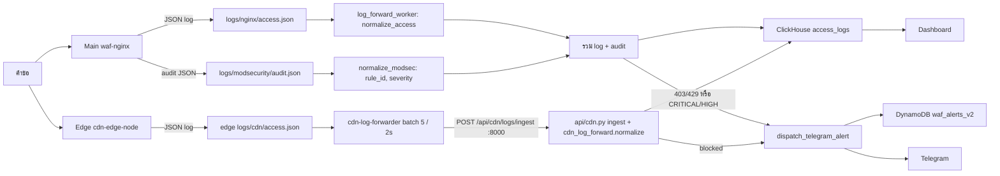

# บทที่ 14 — ระบบบันทึก (Logging)

## 14.1 เส้นทางของ log



*รูปที่ 13 — เส้นทาง log จากคำขอจนถึง dashboard และ alert*

```text
Request → nginx/ModSecurity (Main หรือ Edge) → ไฟล์ JSON → normalize → ClickHouse (+DynamoDB บางส่วน) → Dashboard / Alert / ML
```

## 14.2 แหล่ง log

| แหล่ง | ไฟล์ | ผู้อ่าน | ความสดของข้อมูล (2026-09-27) |
|---|---|---|---|
| Main nginx access log (`json_combined`) | `logs/nginx/access.json` | `log_forward_worker` (backend), `waf-log-analyzer` | เขียนต่อเนื่อง |
| Main ModSecurity audit | `logs/modsecurity/audit.json` (หมุนเป็น `.gz`) | `log_forward_worker` (`normalize_modsec`) | เขียนต่อเนื่อง |
| Edge nginx access log (`cdn_json`) | บน edge: `/root/edge_node/logs/cdn/access.json` | `cdn-log-forwarder` → `POST /api/cdn/logs/ingest` | ส่งต่อเนื่อง |
| CDN แบบเดิมบน Main | `logs/cdn/{th,sg,jp}/access.json` | `waf-log-analyzer` | หยุดตั้งแต่ ส.ค. 2026 → DEPRECATED |

## 14.3 การแปลงข้อมูล (Normalization)

`services/log_forward.py`
- `normalize_access(data)` แปลงฟิลด์ของ nginx (`remote_addr`, `request`, `status`, `request_time`, `http_user_agent`, `host`, `request_id` …) เป็นรูปแบบกลาง (`ip`, `method`, `url`, `status`, `latency_ms`, `user_agent`, `host` …) และตั้ง `alert` ตามสถานะ 403
- `normalize_modsec(data)` ดึง `ruleId`, ข้อความ และ severity จาก ModSecurity audit เพื่อเติม `rule_id`, `attack_type`, `severity`
- จับคู่ access log กับ audit ด้วย `request_id` (nginx ใช้ `$request_id` เป็น `modsecurity_transaction_id`)

`services/cdn_log_forward.py::normalize_cdn_access` ทำหน้าที่เดียวกันกับ log จาก edge และเติม `edge_node`, `cache_status`

`services/clickhouse_service.py`
- `country` คำนวณจาก IP ด้วย `services/geoip.py` (DB-IP Lite) ไม่ใช้ค่าที่ส่งมา; IP ส่วนตัว/ภายในได้ค่าว่าง
- `host` ถูก normalize (`normalize_host`) และ `edge_node` ถูก map ด้วย `resolve_edge_node`
- `save_logs_bulk` ใส่ข้อมูลจาก edge ทีละ batch เพื่อให้ทันเวลา

## 14.4 การจัดเก็บและอายุข้อมูล

- `access_logs` TTL **30 วัน** (ปรับด้วย `ACCESS_LOGS_RETENTION_DAYS`)
- `save_hybrid_log` เขียนทั้ง ClickHouse และ DynamoDB `waf_logs`
- log ของ deception เขียนทั้ง `access_logs` และ `security_audit_logs`

## 14.5 ข้อจำกัด

- traffic ที่มาทาง edge ถูกบันทึกที่ Main ด้วย IP ของ edge (Main ไม่ได้ตั้ง `set_real_ip_from`) แต่ log ที่ edge ส่งผ่าน ingest มี IP จริง
- client ของ ClickHouse เป็น object เดียวที่ใช้ร่วมกัน โค้ดเลือก insert แบบ batch จาก thread เดียวเพื่อเลี่ยงปัญหา thread-safety

## แหล่งอ้างอิง (Evidence)
- `services/log_forward.py` (77–322), `services/cdn_log_forward.py`, `services/clickhouse_service.py`, `api/cdn.py:507`
- `ls -l logs/...` บน Main, `/root/edge_node/docker-compose.yml`
