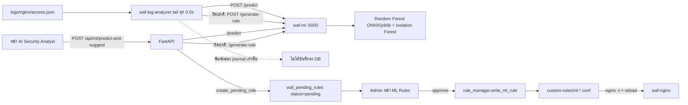
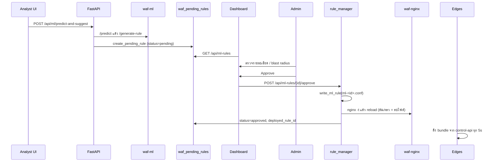

# บทที่ 16 — Machine Learning

## 16.1 สรุปสถานะ

| ส่วน | สถานะ | หลักฐาน |
|---|---|---|
| ML service (`waf-ml`, `ml/ml_api.py`) โหลดโมเดลครบ | VERIFIED | `GET 127.0.0.1:5000/health` → `models_loaded: random_forest=true, isolation_forest=true`, `onnx_inline.loaded=true` |
| ความแม่นยำตามเป้า | **ไม่ผ่านเป้า** | `/health`: `eval_accuracy: 0.8047`, `accuracy_target_passed: false` |
| ผลประเมินโมเดล | accuracy 0.8047, ROC-AUC 0.8847, attack precision 0.9839, **attack recall 0.6226**, benign recall 0.9897 | `ml/models/eval_results.json` (CSIC 2010 + payload เสริม, test 15,027 ตัวอย่าง) |
| log analyzer อ่าน log จริงและเรียก `/predict` | VERIFIED (โค้ด), ไม่มี output ใน journal 2 ชั่วโมงที่ตรวจ | `ml/async_log_analyzer.py` |
| กฎที่ analyzer "เสนอ" ถูกบันทึกเพื่อรออนุมัติ | **ไม่ใช่** — analyzer พิมพ์ผลเท่านั้น | `ml/async_log_analyzer.py:108–118` |
| กฎรออนุมัติจากหน้า AI Security Analyst | VERIFIED | `api/ml.py:174` `create_pending_rule` |
| การอนุมัติกฎ → ไฟล์ ModSecurity → reload | VERIFIED | `services/ml_rule_service.py::approve_rule` → `rule_manager.write_ml_rule` |
| บล็อกอัตโนมัติด้วย ML | ไม่มี (PLANNED) | – |
| Threshold self-tuning (เสนอเท่านั้น) | VERIFIED | `services/threshold_proposal_service.py` |

## 16.2 ข้อมูลเข้าและคุณลักษณะ (Features)

- input: `url`, `method`, `body` ของคำขอ
- `ml/feature_engineering.py` แปลงเป็นเวกเตอร์ (ความยาว, สัดส่วนอักขระพิเศษ, keyword ของการโจมตี ฯลฯ — ดูรายการ `FEATURE_COLUMNS` ในไฟล์)
- โมเดล: `ml/models/random_forest_waf.onnx` (+ `.joblib`), `isolation_forest_waf.joblib`, metadata ใน `model_metadata.json`, ผลประเมินใน `eval_results.json`

## 16.3 Endpoint ของ ML service

| Endpoint | หน้าที่ |
|---|---|
| `GET /health` | สถานะโมเดลและผลประเมิน |
| `GET /eval-results` | ผลประเมินโมเดล |
| `POST /predict` | คืน `is_anomaly`, `attack_probability` |
| `POST /predict-fast` | inference ด้วย ONNX |
| `POST /generate-rule` | สร้าง pattern ModSecurity จากคำขอ (`ml/auto_rule_generator.py` — จับรูปแบบ SQLi, XSS, traversal, command injection, SSRF metadata, template injection ฯลฯ) |
| `POST /capture` | เก็บ telemetry จาก relay ภายใน |

## 16.4 ขั้นตอนการเสนอและอนุมัติกฎ

*รูปที่ 14 — ML analysis flow ตามที่โค้ดทำจริง*

*รูปที่ 15 — Rule recommendation และการอนุมัติ*

- กฎที่อนุมัติถูกเขียนเป็น `modsecurity/custom-rules/ml-<id>.conf` ถ้า `nginx -t` ไม่ผ่าน ไฟล์จะถูกลบและ error ถูกส่งกลับ
- edge ได้กฎใหม่ผ่าน bundle ภายใน ~5 วินาที

## 16.5 Threshold proposals (self-tuning)

`/api/threshold-proposals/generate` วิเคราะห์อัตราการบล็อกต่อ origin จาก ClickHouse แล้ว "เสนอ" ปรับ anomaly threshold ที่ใช้ร่วมกันทั้งระบบ
- origin ที่มีคำขอน้อยกว่า **200** ในช่วงที่วิเคราะห์ไม่ถูกนำมาตัดสิน
- ไม่เปลี่ยนค่าเอง ต้อง approve (และ rollback ได้) ผ่าน `SettingsService.update_settings`

## 16.6 ข้อจำกัด

- ความแม่นยำ 80.47% ต่ำกว่าเป้าที่โค้ดกำหนด และจับการโจมตีได้เพียง 62.26% (recall) จึงเหมาะเป็นตัวช่วยตัดสินใจเท่านั้น — ทีมกำหนดไว้ว่าห้ามเพิ่มเส้นทาง deploy กฎจาก ML โดยอัตโนมัติ (ต้องผ่าน admin approve)
- analyzer ยังอ่านช่อง log `TH/SG/JP` แบบเดิมที่ไม่มีข้อมูลใหม่แล้ว

## แหล่งอ้างอิง (Evidence)
- `ml/ml_api.py`, `ml/async_log_analyzer.py`, `ml/auto_rule_generator.py`, `ml/feature_engineering.py`, `ml/models/`
- `dashboard/backend/api/ml.py`, `api/ml_rules.py`, `services/ml_rule_service.py`, `services/threshold_proposal_service.py`
- `curl http://127.0.0.1:5000/health` บน Main (2026-09-27)
