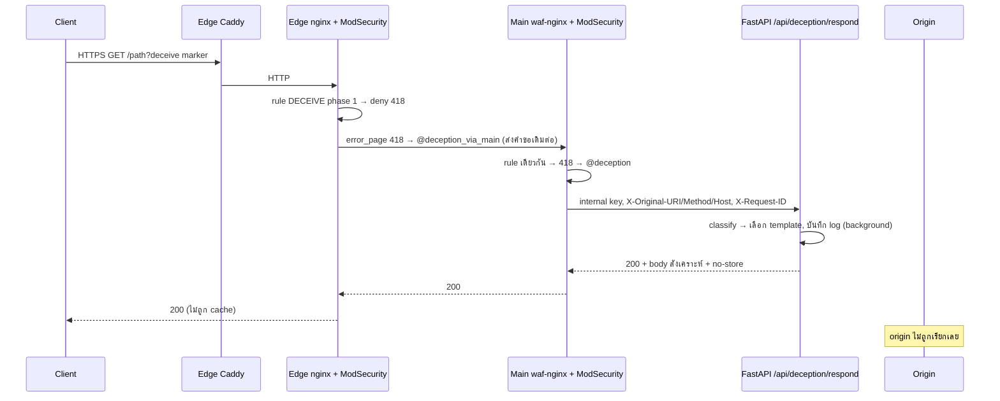

# บทที่ 17 — Deception Layer (ชั้นหลอกล่อผู้โจมตี)

> ข้อมูลทั้งหมดที่ deception layer ส่งกลับเป็น **ข้อมูลสังเคราะห์ (synthetic)** ที่เขียนไว้ในโค้ด ไม่ได้อ่านจากไฟล์หรือฐานข้อมูลจริงของเครื่องใดๆ และ origin ไม่ถูกติดต่อ

## 17.1 ภาพรวม

แทนที่จะตอบ 403 กับคำขอบางประเภท ระบบตอบ 200 พร้อมเนื้อหาปลอมที่ดูเหมือนการโจมตีสำเร็จ เพื่อสิ้นเปลืองเวลาของผู้โจมตีและเก็บข้อมูลพฤติกรรม โดยใช้ status พิเศษ **418** เป็นสัญญาณภายในระหว่าง ModSecurity กับ nginx

*รูปที่ 12 — ลำดับการทำงานของคำขอที่ถูกส่งเข้า deception*

## 17.2 การเลือกคำขอที่จะหลอก

- ผู้ดูแลสร้างกฎ action **DECEIVE** จากหน้า WAF Rules (`services/rule_manager.py`) ได้ directive `phase:1,deny,status:418,tag:'action:deceive'`
- ทำงานใน **phase 1** เพื่อให้ตัดสินก่อน CRS 949110 (anomaly block ใน phase 2) ข้อจำกัด: phase 1 ยังไม่มี body จึงห้ามใช้ `REQUEST_BODY` กับ DECEIVE (ระบบปฏิเสธ)
- กฎทดสอบที่มีอยู่: `modsecurity/custom-rules/custom-deceive.conf` (id 9000000 และ 9000001 จับ marker ใน `REQUEST_URI`)
- คำขอโจมตีทั่วไปที่ไม่ตรงกฎ DECEIVE ยังถูก CRS บล็อกด้วย 403 ตามปกติ (ทดสอบจริง)

## 17.3 การส่งต่อ

| ชั้น | กลไก | ไฟล์ |
|---|---|---|
| Edge | `error_page 418 = @deception_via_main` → proxy คำขอเดิมไป Main (ไม่มี cache, timeout 2s/5s) | edge `default.conf.template` |
| Main | `error_page 418 = @deception` → rewrite เป็น `/api/deception/respond` → FastAPI | `nginx/templates/conf.d/default.conf.template` |
| Main | header ที่ส่ง: `X-Internal-Deception-Key`, `X-Request-ID`, `X-Real-IP`, `X-Original-URI`, `X-Original-Method`, `X-Original-Host`; ล้าง `X-Deception-Template`, `X-Matched-Rule-ID` ที่ client ส่งมา | เดียวกัน |
| Main | `proxy_connect_timeout 1s`, `proxy_read_timeout 3s`; ถ้า backend ตอบ 502/504 ใช้ `@deception_static` (body สังเคราะห์แบบคงที่) | เดียวกัน |

## 17.4 การสร้าง response

`services/deception_service.py`
1. **จัดประเภท** (`classify_attack`): hint → regex (path traversal / SQLi ที่จำกัดความยาว input 4096 และ regex ถูกออกแบบไม่ให้ backtrack มาก) → heuristic จาก URL/พารามิเตอร์ → ค่าตั้งต้นเป็น path traversal
2. **เลือก template** ในหน่วยความจำ:

| Template | Content-Type | เนื้อหา |
|---|---|---|
| `path_traversal` | text/plain | ไฟล์รูปแบบ `/etc/passwd` ที่มีบัญชีสมมติ |
| `sql_injection` | application/json | schema และแถวข้อมูลสมมติ (hash ปลอม) |

3. ตอบ 200 พร้อม header ห้าม cache: `Cache-Control: no-store, no-cache, must-revalidate, proxy-revalidate, max-age=0, private, s-maxage=0`, `Pragma`, `Expires: 0`, `Surrogate-Control`, `CDN-Cache-Control`
4. การจัดประเภทรันใน thread (`asyncio.to_thread`) timeout 1 วินาที ถ้าผิดพลาดใช้ fallback response

## 17.5 การควบคุมความปลอดภัย

| การควบคุม | รายละเอียด |
|---|---|
| Internal key | `DECEPTION_INTERNAL_KEY` จาก `.env` เท่านั้น ไม่มีค่า default; ไม่ตรง → 403 |
| Endpoint admin | `GET /api/deception/templates`, `POST /api/deception/simulate` ต้องเป็น admin |
| กฎ | ห้าม CR/LF/NUL ใน operator/message, escape เครื่องหมายคำพูด, ถ้า `nginx -t` ไม่ผ่านคืนกฎเดิม |
| Cache | edge ไม่ cache named location นี้, response เป็น no-store |
| Origin | ไม่มีเส้นทางใดใน `@deception` ที่ไปหา origin |

## 17.6 การบันทึก

`log_deception_event` (background task, แยก lock สำหรับ ClickHouse) เขียน
- `access_logs` (`attack_type = "Deception: …"`, `host`, `rule_id`)
- `security_audit_logs` (`action = DECEIVE`)
- DynamoDB `waf_logs`
ความล้มเหลวในการบันทึกไม่กระทบ response

## 17.7 ข้อจำกัดที่ทราบ

- การเลือก template SQLi อาศัย heuristic จาก argument; marker ที่ไม่มีพารามิเตอร์อาจได้ template path traversal
- รายละเอียดของ response ยังแตกต่างจาก response ปกติของ origin ในบางจุด (ผลการทดสอบ 2026-09-27)

## แหล่งอ้างอิง (Evidence)
- `api/deception.py`, `services/deception_service.py`, `services/rule_manager.py`, `modsecurity/custom-rules/custom-deceive.conf`
- `nginx/templates/conf.d/default.conf.template` (`@deception`, `@deception_static`), `cdn/edge/templates/conf.d/default.conf.template` (`@deception_via_main`)
- ทดสอบจริง 2026-09-27: marker → 200 synthetic; LFI/SQLi จริง → 403; ผ่าน edge → 200 no-store
