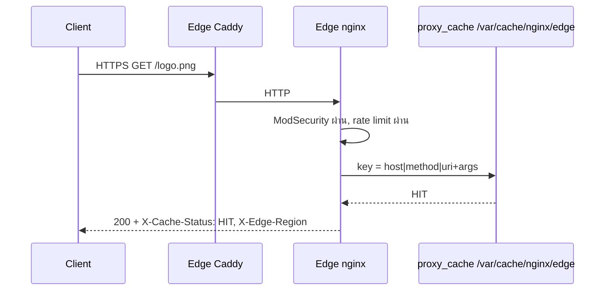
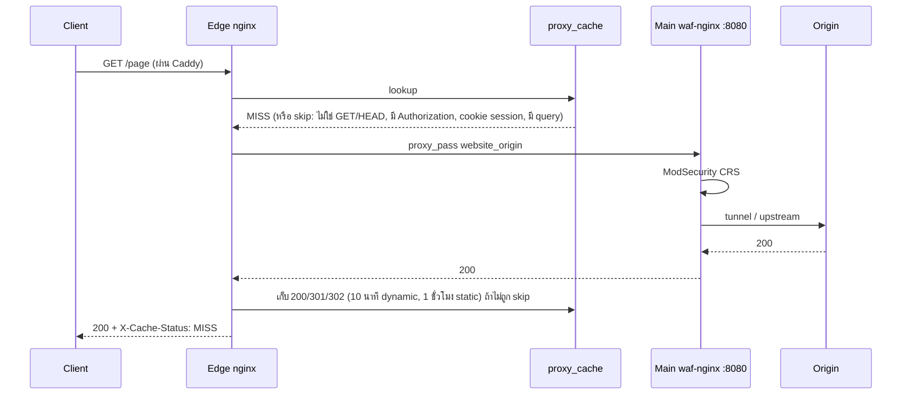
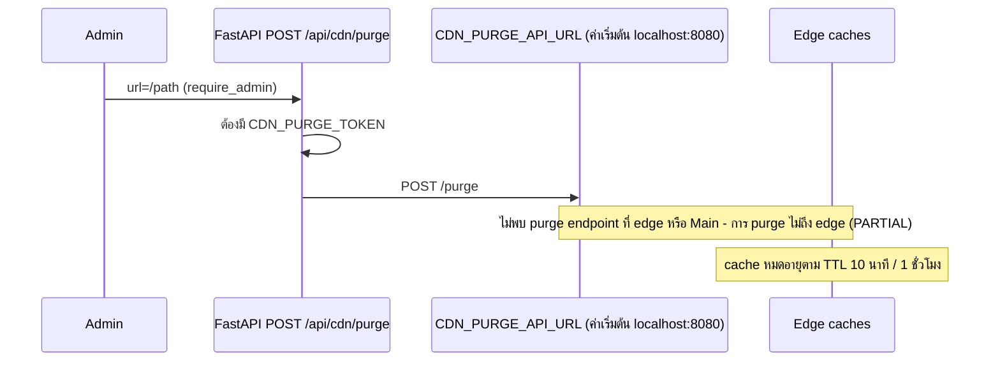

# บทที่ 24 — Caching

## 24.1 กติกาของ cache ที่ edge (`edge/templates/conf.d/default.conf.template`)

| หัวข้อ | Dynamic (`location /`) | Static (`.css .js .png ...`) |
|---|---|---|
| Cache key | `$host\|$request_method\|$uri$is_args$args` | เหมือนกัน |
| เก็บ status | 200, 301, 302 | 200, 301, 302 |
| TTL | 10 นาที | 1 ชั่วโมง |
| `Cache-Control` ที่ edge ใส่ให้ client | `public, max-age=600, must-revalidate` | `public, max-age=3600, immutable` |
| Stale | `proxy_cache_use_stale error timeout ... updating 5xx`, background update, lock | เหมือนกัน |

**ไม่ cache (`$skip_cache = 1`)** เมื่อ: method ไม่ใช่ GET/HEAD, มี `Authorization`, cookie มี `PHPSESSID`/`security=`/`waf_clearance`/`waf_otp_clearance`, client ส่ง `Cache-Control: no-cache|no-store`, หรือ **มี query string**

nginx ยังเคารพ `Cache-Control: no-store/private` จาก upstream (ไม่ได้ตั้ง `proxy_ignore_headers`)

## 24.2 Cache hit / miss

*รูปที่ 16 — Cache hit ที่ edge*

*รูปที่ 17 — Cache miss และการเติม cache*

## 24.3 การล้าง cache (Invalidation / Purge)

*รูปที่ 18 — เส้นทาง purge ตามโค้ดปัจจุบัน*

- `POST /api/cdn/purge` (admin) ส่งต่อไป `CDN_PURGE_API_URL` ซึ่ง **ไม่ได้ตั้งค่า** → ใช้ค่าเริ่มต้น `http://localhost:8080` ไม่พบ endpoint `/purge` ที่ Main หรือ edge → **การ purge ไม่ถึง edge (PARTIAL)**
- ค่า `auto_purge_edge_cache` ในหน้า Settings จึงยังไม่มีผลกับ edge จริง
- วิธีที่ใช้ได้จริง: รอ TTL หมด หรือผู้ดูแลลบไฟล์ใน volume `edge_cache` บน edge (ดูบทที่ 45)

## 24.4 ข้อจำกัด

- edge ใส่ `Cache-Control: public` ด้วย `add_header ... always` แม้ origin ตอบ `no-store` (เช่นหน้าที่ตั้ง session cookie) ผู้ใช้/CDN ถัดไปจะเห็น Cache-Control 2 ค่า (edge เองไม่ cache เพราะ nginx เคารพ no-store)

## แหล่งอ้างอิง (Evidence)
- edge `default.conf.template`, `nginx.conf.template`; `api/cdn.py:30, 337–360`; `docker ps` (ไม่มี purge-api)
