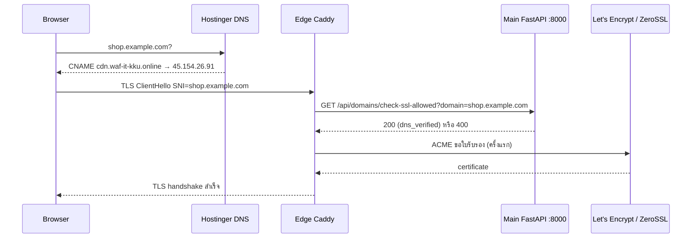

# บทที่ 26 — TLS

## 26.1 จุดที่ถอดรหัส TLS

| จุด | ใคร | ใบรับรอง |
|---|---|---|
| Edge (โดเมนลูกค้าและแล็บ) | `cdn-caddy-ssl` | on-demand ต่อโดเมน |
| Main (dashboard `waf-it-kku.online` และโดเมนที่ชี้มา Main) | `caddy-ssl-termination` | ตามรายชื่อใน Caddyfile + on-demand |
| Edge → Main | HTTP ธรรมดาไปพอร์ต 8080 | ไม่มี TLS (ข้อจำกัด) |
| Main → origin | ผ่าน tunnel (CloudWAF tunnel ใช้ TLS; FRP ตามการตั้งค่า frps) | – |

## 26.2 การออกใบรับรองอัตโนมัติ

*รูปที่ 19 — DNS + TLS flow*

- Caddy ถาม `GET /api/domains/check-ssl-allowed?domain=<host>` ก่อนออกใบ อนุญาตเฉพาะชื่อที่ถูกต้องตามรูปแบบและอยู่ในรายการที่ backend โหลดจากโดเมนที่ยืนยันแล้ว (`_load_ssl_allowed_from_db`) ตอบ 400 ถ้าไม่ได้รับอนุญาต — ตรวจจริงแล้ว
- ผู้ออกใบที่พบจริง: Let's Encrypt (`waf-it-kku.online`, `www.originweb.site`) และ ZeroSSL (`dvwa.waf-it-kku.online`)
- Caddy ต่ออายุใบเองก่อนหมดอายุ (พฤติกรรมมาตรฐานของ Caddy) ใบที่ตรวจหมดอายุ 22 พ.ย. และ 22 ธ.ค. 2026

## 26.3 ข้อควรระวังในการดูแล

- Caddyfile ถูก mount เป็นไฟล์เดี่ยว: แก้แล้วต้อง restart container หรือแก้แบบ in-place (เคยเกิดกรณี container ใช้ config เก่าที่อนุญาตทุกโดเมน)
- `ssl_cert_monitor_worker` ตรวจสถานะใบรับรองของแต่ละโดเมนให้หน้า Origin Detail

## แหล่งอ้างอิง (Evidence)
- `nginx/Caddyfile`, edge `Caddyfile`, `api/domains.py` (`check_ssl_allowed`), `openssl s_client` (issuer/วันหมดอายุ)
