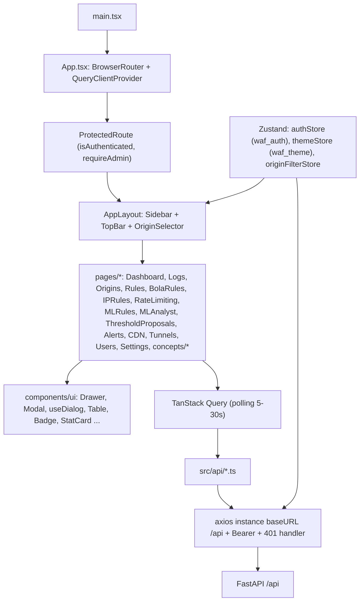

# บทที่ 27 — สถาปัตยกรรม React

## 27.1 ภาพรวม

Dashboard เป็น Single Page Application (SPA) เขียนด้วย React 18 + TypeScript build ด้วย Vite ได้ไฟล์ใน `dashboard/frontend/dist` ซึ่ง FastAPI เสิร์ฟให้เองที่พอร์ต 8000 ผ่าน Caddy ของ Main (`https://waf-it-kku.online`)

*รูปที่ 7 — องค์ประกอบของ frontend*

## 27.2 ชั้นต่างๆ

| ชั้น | เทคโนโลยี | ไฟล์ | หน้าที่ |
|---|---|---|---|
| Routing | React Router 6 | `App.tsx` | 35 route, `ProtectedRoute` |
| Data fetching | TanStack Query 5 | ทุกหน้า | cache, polling (5–30 วินาทีตามหน้า) |
| HTTP | Axios | `api/axios.ts` | `baseURL: '/api'`, `withCredentials`, ใส่ `Authorization: Bearer`, จัดการ 401 |
| State | Zustand (persist) | `store/authStore.ts`, `themeStore.ts`, `originFilterStore.ts` | session (`localStorage['waf_auth']`), ธีม (`waf_theme`), origin ที่เลือก |
| UI | Tailwind 3 + CSS variables | `index.css`, `components/ui/*` | ธีมมืด/สว่าง, component กลาง |
| Dialog | `Drawer`, `Modal`, `useDialog` | `components/ui` | focus trap, Escape, scroll lock ร่วมกัน |
| Charts | Recharts | Dashboard, CDN | กราฟ traffic |

## 27.3 การตรวจคุณภาพ

- `npx tsc -b` และ `vite build` ผ่านที่ commit `c033758` (ตรวจ 2026-09-27)
- มี unit test ของ lib (`src/lib/*.test.ts`) และชุด Playwright/axe (ดู Part IX)

## แหล่งอ้างอิง (Evidence)
- `dashboard/frontend/src/App.tsx`, `api/axios.ts`, `store/*.ts`, `components/ui/*`, `package.json`
