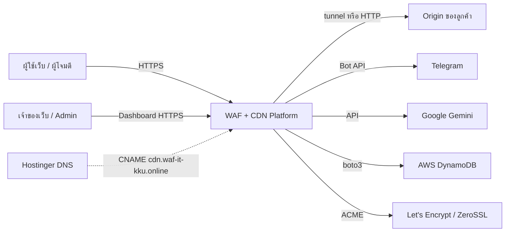
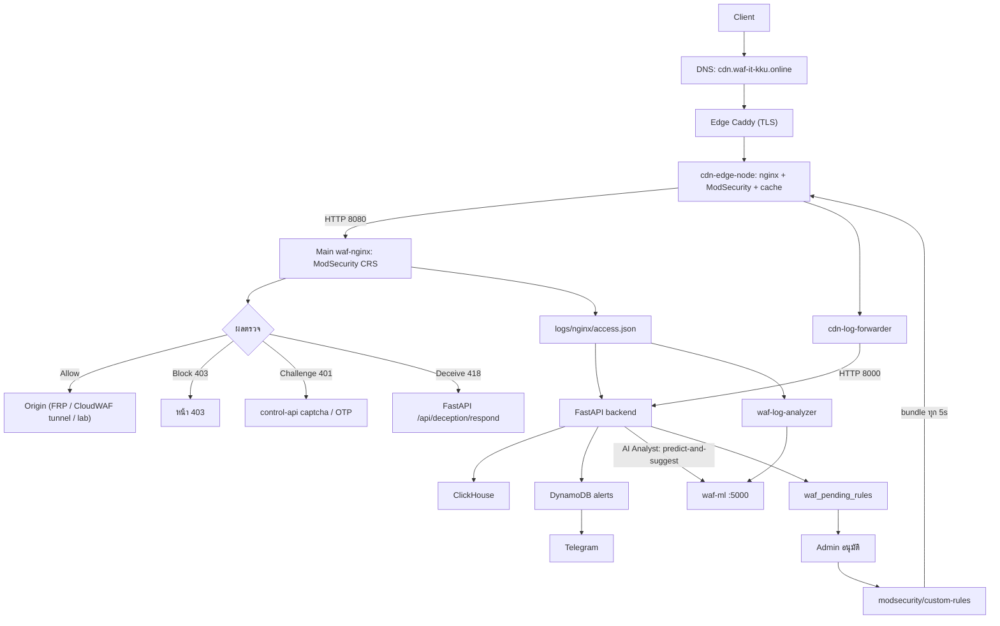

# บทที่ 04 — ภาพรวมโครงสร้างพื้นฐาน (Infrastructure Overview)

## 4.1 แนวคิด

ระบบวางตัวแบบ "ศูนย์กลาง + ขอบ" (hub and edge):

- **Main** (Hetzner, เยอรมนี) คือศูนย์กลาง: WAF ชั้นในที่ตัดสินใจสุดท้าย, backend, ฐานข้อมูล, ML, tunnel server และ control-api สำหรับแจกกฎ
- **Edge** 2 เครื่อง (ไทย และ Azure) คือจุดที่ผู้ใช้เข้ามาก่อน: ถอดรหัส TLS, ตรวจ WAF ชั้นนอก, cache และส่ง log กลับ Main

การแยกชั้นนี้ทำให้คำขอที่ถูก cache หรือถูกบล็อกที่ edge ไม่ต้องข้ามทวีปมาที่ Main

## 4.2 ภาพระบบ (System context)

*รูปที่ 1 — System context: ผู้ใช้ ระบบ และบริการภายนอก*

## 4.3 สถาปัตยกรรมระดับสูง (High-level architecture)

*รูปที่ 2 — สถาปัตยกรรมระดับสูงตามเส้นทางคำขอจริง*

## 4.4 บริการภายนอก (External services)

| บริการ | ใช้ทำอะไร | ใช้จริงหรือไม่ | หลักฐาน |
|---|---|---|---|
| AWS DynamoDB | เก็บผู้ใช้, origin, โดเมน, alert, rule ที่รออนุมัติ | VERIFIED | `services/dynamodb_service.py`, `services/auth_service.py` |
| Telegram Bot API | ส่ง alert ให้ผู้ใช้ที่ผูก `telegram_chat_id` | VERIFIED (โค้ด) | `services/telegram_listener.py` |
| Google Gemini | สรุป/อธิบาย alert, AI copilot | VERIFIED (โค้ด), ติด quota free tier ใน journal | `services/gemini_service.py` |
| Let's Encrypt / ZeroSSL | ออกใบรับรอง TLS ผ่าน Caddy | VERIFIED | issuer ของ `waf-it-kku.online` (Let's Encrypt), `dvwa.waf-it-kku.online` (ZeroSSL) |
| Hostinger DNS | authoritative DNS ของ `waf-it-kku.online` | VERIFIED | `dig NS` |
| DB-IP Lite | ฐาน GeoIP ประเทศ | VERIFIED | `/etc/cron.d/waf-geoip`, `services/geoip.py` |
| Google OAuth | เข้าสู่ระบบด้วย Google | VERIFIED (โค้ด) | `api/auth.py` `/google`, `/google/callback` |
| SMTP | ส่ง OTP ทางอีเมล | UNKNOWN — ค่าเริ่มต้นว่าง | `docker-compose.yml` (`SMTP_HOST` ว่าง) |
| Cloudflare | – | ไม่ได้ใช้ | ไม่พบใน DNS/โค้ดที่รัน |

## 4.5 หลักการที่ควรรู้

- **Tunnel ขาออก**: origin เชื่อมออกมาหา Main (FRP พอร์ต 7000 หรือ CloudWAF tunnel พอร์ต 8050) Main จึงเข้าถึง origin ได้โดย origin ไม่ต้องเปิดพอร์ตใดๆ
- **กฎกระจายจากศูนย์กลาง**: ไฟล์กฎใน `modsecurity/custom-rules` บน Main ถูกแพ็กเป็น bundle ที่ `control-api /api/sync/bundle` edge ดึงทุก 5 วินาทีแล้ว reload nginx
- **Log ไหลกลับศูนย์กลาง**: Main อ่าน log ของตัวเอง ส่วน edge ส่ง log ผ่าน `cdn-log-forwarder` ไปที่ backend `:8000`

## แหล่งอ้างอิง (Evidence)
- `docs/_evidence/runtime-2026-09-27.md`, `docker-compose.yml`, `/root/edge_node/docker-compose.yml` (edge-th)
- `cdn/edge/entrypoint.d/99-rulesync.sh`, `cdn/control-api/main.py`
- `openssl s_client` ตรวจ issuer, `dig NS waf-it-kku.online`
