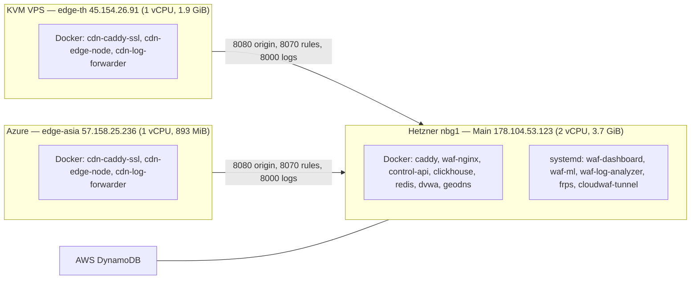

# บทที่ 05 — รายการเครื่องและโหนด (Machine and Node Inventory)

## 5.1 จำนวนจริง

ณ วันที่ตรวจมี **เครื่องเสมือน (VM) 3 เครื่อง** และ **container ที่รันอยู่ 13 ตัว** (Main 7, edge-th 3, edge-asia 3) และ **systemd service ของระบบ 5 ตัว** บน Main (ไม่นับ docker/containerd)

ลำดับชั้นที่ถูกต้องคือ `Cloud host → VM → Container/Service → Application` — container ไม่ใช่ "เครื่อง"

*รูปที่ 3 — เครื่องจริง 3 เครื่องและสิ่งที่รันบนแต่ละเครื่อง*

## 5.2 รายละเอียดแต่ละเครื่อง

| รายการ | Main | edge-th | edge-asia |
|---|---|---|---|
| IP สาธารณะ | 178.104.53.123 | 45.154.26.91 | 57.158.25.236 |
| ผู้ให้บริการ | Hetzner vServer (nbg1-dc3, eu-central) | VPS แบบ KVM/QEMU (ผู้ให้บริการไม่ระบุใน DMI) | Microsoft Azure VM |
| OS | Ubuntu 26.04 LTS (kernel 7.0.0-30) | Ubuntu 24.04.4 LTS | Ubuntu 24.04.4 LTS |
| CPU / RAM | 2 vCPU / 3.7 GiB | 1 vCPU / 1.9 GiB | 1 vCPU / 893 MiB |
| Disk | 38 GB (ใช้ 73%) | 29 GB (57%) | 29 GB (44%) |
| บทบาท | WAF หลัก, API, DB, ML, tunnel, control-api | edge (ไทย) | edge (เอเชีย) |
| ที่ตั้งไฟล์ deploy | `/root/waf_project` | `/root/edge_node` | `/opt/edge_node` |
| Firewall ของเครื่อง | ufw active, INPUT DROP | ufw active | ufw inactive (พึ่ง Azure NSG — ไม่ได้ตรวจ) |
| สถานะ | VERIFIED | VERIFIED | VERIFIED |

## 5.3 แยกประเภทสภาพแวดล้อม

| ประเภท | สิ่งที่พบ | สถานะ |
|---|---|---|
| Production ที่ใช้งานจริง | 3 เครื่องข้างต้น | VERIFIED |
| Development | เครื่องนักพัฒนาเก็บ git clone ไว้ (ไม่ได้เป็นส่วนของระบบที่ให้บริการ) | VERIFIED |
| ส่วนจำลอง (lab) | `dvwa` บน Main และโดเมนแล็บ `juice.`, `vampi.`, `bwapp.` ที่ต่อผ่าน tunnel | VERIFIED |
| Lab node `10.198.200.75` | เครื่องทดสอบใช้ร่วมกัน (ไม่อยู่ใน git, ใช้ FRP agent เดียวกัน) — ระบุในบันทึกของทีม ไม่ได้ตรวจในรอบนี้ | UNKNOWN |
| Edge ในโค้ดแต่ไม่มีเครื่องจริง | ชื่อ `SG`, `JP` ใน `ml/async_log_analyzer.py` และ `scripts/sync_waf_rules.py` (container `cdn-edge-sg/jp` แบบเดิม) | DEPRECATED |
| โหนดในอนาคต | edge เพิ่มเติม — `cdn/geodns/server.py` ระบุว่าต้องแก้ตรรกะการเลือก region ก่อน | PLANNED |

## แหล่งอ้างอิง (Evidence)
- `hostnamectl`, `nproc`, `free -h`, `df -h`, Hetzner metadata (Main)
- `docker ps` บนทั้ง 3 เครื่อง, `systemctl list-units --type=service`
