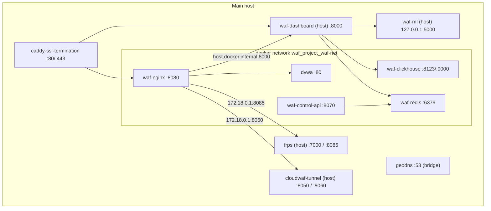

# บทที่ 06 — สถาปัตยกรรม Container

## 6.1 Main: `docker-compose.yml`

*รูปที่ 4 — Container และ service บนเครื่อง Main*

| Service (compose) | Container | Image | พอร์ต host | Volume สำคัญ | Health check | หน้าที่ |
|---|---|---|---|---|---|---|
| `waf` | waf-nginx | owasp/modsecurity-crs:nginx | 8080, 8443 | templates nginx/ModSecurity (ro), `modsecurity/custom-rules` → `/opt/custom-rules` (ro), `logs/nginx`, `logs/modsecurity` | `curl -sf http://localhost:8080/healthz` ทุก 30s | WAF หลัก, routing, deception |
| `dvwa` | dvwa | sagikazarmark/dvwa | – | – | – | เว็บแล็บ |
| `caddy` | caddy-ssl-termination | caddy:alpine | 80, 443 | `nginx/Caddyfile`, `caddy_data`, `caddy_config` | – | TLS + reverse proxy |
| `redis` | waf-redis | redis:alpine | 6379 | – | – | state/cache |
| `clickhouse` | waf-clickhouse | clickhouse/clickhouse-server:latest | 8123, 9000 | `clickhouse_data` | – | log DB |
| `control-api` | waf-control-api | build `./cdn/control-api` | 8070 | `custom-rules` (ro), `control_data` | – | challenge, blocklist, rule bundle |
| (แยก) | geodns | geodns:latest | 53, 8053 | – | – | GeoDNS (PARTIAL) |

**หมายเหตุการตั้งค่า**
- `waf-nginx` รับค่า `PARANOIA=1`, `ANOMALY_INBOUND=10`, `ANOMALY_OUTBOUND=10` จาก compose และอ่าน `.env` (มี `DECEPTION_INTERNAL_KEY`) ผ่าน `env_file`
- template ถูก render ด้วย `envsubst` ตอน container เริ่ม (`/docker-entrypoint.d/20-envsubst-on-templates.sh`) แก้ template แล้วต้อง render ใหม่ก่อน `nginx -s reload`
- ไฟล์ที่ mount แบบไฟล์เดี่ยว (single-file bind mount) ต้องแก้แบบเขียนทับในไฟล์เดิม (in place) ถ้าแทนไฟล์ใหม่ container จะยังเห็น inode เก่า (พบจริงกับ Caddy และ waf-nginx เมื่อ 2026-09-27)
- backend, ML, tunnel ไม่ได้อยู่ใน container แต่เป็น **systemd service บน host** และเข้าถึงจาก container ผ่าน `host.docker.internal` / `172.18.0.1`

## 6.2 Edge: `/root/edge_node/docker-compose.yml` (edge-th) และ `/opt/edge_node` (edge-asia)

| Service | Container | Image | พอร์ต | สำคัญ |
|---|---|---|---|---|
| `caddy-ssl` | cdn-caddy-ssl | caddy:alpine | 80, 443 | on-demand TLS, security headers, `reverse_proxy cdn-edge-node:80` |
| `edge-node` | cdn-edge-node | owasp/modsecurity-crs:nginx | ภายใน | env `ORIGIN_HOST=<Main>`, `ORIGIN_PORT=8080`, `SYNC_INTERVAL_SEC=5`, rate limit 50 r/s burst 100/200, volume `edge_cache` → `/var/cache/nginx`, health check `curl /healthz` ทุก 10s |
| `log-forwarder` | cdn-log-forwarder | python:3.11-slim | – | อ่าน `/logs/access.json` ส่งไป `MAIN_SERVER_URL` (Main `:8000`) batch 5 รายการ/ทุก 2 วินาที |

`edge/entrypoint.d/99-rulesync.sh` วนดึง `${CONTROL_API_URL}/api/sync/bundle` เทียบ hash แล้วแตกไฟล์ลง `/opt/custom-rules` + `nginx -s reload` เมื่อเปลี่ยน

## 6.3 systemd บน Main

| Unit | คำสั่ง | Working dir | พอร์ต |
|---|---|---|---|
| waf-dashboard | `.venv/bin/python main.py` | `/root/waf_project/dashboard/backend` | 0.0.0.0:8000 |
| waf-ml | `.venv/bin/uvicorn ml_api:app --host 127.0.0.1 --port 5000` | `/root/waf_project/ml` | 127.0.0.1:5000 |
| waf-log-analyzer | `.venv/bin/python -u async_log_analyzer.py` | `/root/waf_project/ml` | – |
| cloudwaf-tunnel | `.venv/bin/python /opt/cloudwaf-tunnel/server.py` | `/opt/cloudwaf-tunnel` | 8050, 172.18.0.1:8060 |
| frps | `/usr/local/bin/frps -c /etc/frp/frps.toml` | – | 7000, 8085, 127.0.0.1:7500 |

## แหล่งอ้างอิง (Evidence)
- `docker-compose.yml`, `/root/edge_node/docker-compose.yml`, `docker ps`, `docker inspect`, `systemctl show -p ExecStart,WorkingDirectory`
