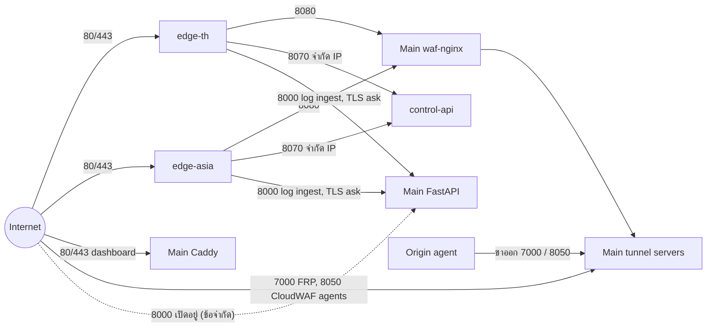

# บทที่ 07 — สถาปัตยกรรมเครือข่าย (Network Architecture)

*รูปที่ 5 — Network topology และพอร์ตที่ใช้สื่อสารจริง*

## 7.1 พอร์ตบน Main

| พอร์ต | Proto | ผู้ฟัง | เปิดสู่ภายนอก (ทดสอบ TCP จากภายนอก) | ใช้โดย |
|---|---|---|---|---|
| 22 | TCP | sshd | อนุญาตใน ufw | ผู้ดูแล |
| 80 / 443 | TCP | caddy-ssl-termination | เปิด | dashboard, โดเมนที่วิ่งเข้า Main ตรง |
| 8080 | TCP | waf-nginx | **เปิด** | edge ใช้เป็น origin |
| 8000 | TCP | FastAPI | **เปิด** | edge log forwarder, Caddy `ask` ของ edge — และเป็นช่องที่เลี่ยง WAF ได้ (ข้อจำกัด) |
| 8070 | TCP | control-api | ปิดจากภายนอกทั่วไป — ufw อนุญาตเฉพาะ IP edge-th/edge-asia | edge rule sync |
| 7000 | TCP | frps | เปิด | FRP agent ของ origin |
| 8050 | TCP | cloudwaf-tunnel | เปิด | CloudWAF agent (TLS + token ต่อ origin) |
| 8060 / 8085 | TCP | tunnel vhost | ภายใน (172.18.0.0/16) | waf-nginx → tunnel |
| 53 | TCP/UDP | geodns | อนุญาต | GeoDNS |
| 6379, 8123, 9000 | TCP | redis, clickhouse | ปิด/ถูกกรอง | ภายในเท่านั้น |
| 5000 | TCP | waf-ml | 127.0.0.1 | backend / analyzer |

ufw ตั้ง INPUT policy เป็น DROP บน Main

## 7.2 Trust zones

| Zone | สมาชิก | ความเชื่อถือ |
|---|---|---|
| Internet | ผู้ใช้, ผู้โจมตี, origin agents | ไม่เชื่อถือ ต้องผ่าน TLS + WAF |
| Edge | edge-th, edge-asia | เชื่อถือบางส่วน: ได้สิทธิ์ดึงกฎ (8070) และส่ง log (8000) ด้วยการจำกัด IP |
| Main host | Caddy, waf-nginx, backend, DB | เชื่อถือ ติดต่อกันผ่าน docker bridge `waf_project_waf-net` (172.18.0.0/16) และ `host.docker.internal` |
| Origin | เครื่องลูกค้า | เชื่อมผ่าน tunnel ที่ยืนยันด้วย token ต่อ origin |

## 7.3 DNS

- โดเมน `waf-it-kku.online` ใช้ DNS ของ Hostinger
- `cdn.waf-it-kku.online` → A 45.154.26.91 (edge-th) โดเมนลูกค้า/แล็บตั้ง CNAME มาที่ชื่อนี้
- การยืนยันความเป็นเจ้าของโดเมนของลูกค้าใช้ CNAME ไป `cdn.waf-it-kku.online` หรือ TXT `_waf-challenge.<domain>` (`services/dns_service.py`)
- edge-asia ยังไม่มี DNS สาธารณะที่ส่ง traffic ไปหาโดยอัตโนมัติ (GeoDNS ไม่ได้เป็น authoritative) → การใช้งานจริงของ edge-asia เป็น **PARTIAL**

## 7.4 ข้อสังเกตด้านความปลอดภัยเครือข่าย

- เรียก FastAPI `:8000` ตรงได้จากอินเทอร์เน็ต ควรจำกัดเฉพาะ docker bridge และ IP edge
- Main บันทึก IP ของ edge เป็น client IP สำหรับ traffic ที่มาทาง edge เพราะยังไม่ได้ตั้ง `set_real_ip_from`

## แหล่งอ้างอิง (Evidence)
- `ss -ltnpu`, `ufw status`, `iptables -S INPUT`, `nc -z` จากภายนอก (Main)
- `nginx/Caddyfile`, `cdn/geodns/server.py`, `services/dns_service.py`, `dig`
