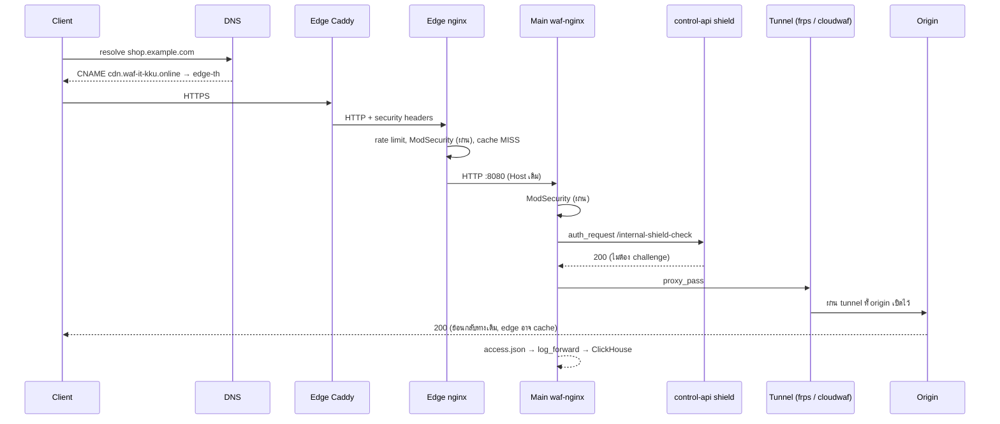

# Flow A — คำขอปกติ (Normal Request)

*รูปที่ 9 — คำขอปกติจาก client ถึง origin*

| ลำดับ | องค์ประกอบ | สิ่งที่เกิด |
|---|---|---|
| 1 | Hostinger DNS | คืน CNAME → edge-th |
| 2 | Edge Caddy | TLS (ใบรับรอง on-demand), เพิ่ม security headers |
| 3 | Edge nginx | rate limit, ModSecurity CRS, ค้น cache |
| 4 | Main waf-nginx | ModSecurity อีกชั้น, `auth_request` shield/rate limit |
| 5 | Tunnel | FRP หรือ CloudWAF tunnel ส่งต่อไป origin |
| 6 | Logging | Main เขียน `access.json` → ClickHouse; edge ส่ง log ผ่าน forwarder |

ถ้าเป็น GET ที่ cache ได้และ HIT ขั้น 4–5 จะไม่เกิด (บทที่ 24)

## แหล่งอ้างอิง (Evidence)
- บทที่ 18, 22–25; template ของ edge และ Main
