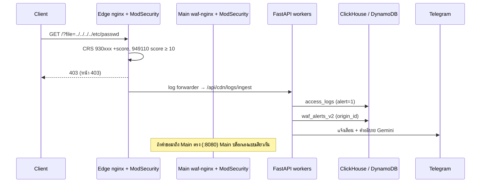

# Flow B — การโจมตีที่ถูกบล็อก (Blocked Attack)



*รูปที่ 10 — คำขอโจมตีถูก CRS บล็อก*

```text
Client → Edge → WAF (CRS anomaly ≥ 10) → Block 403 → Response → Logging → Alert
```

- ทดสอบจริง 2026-09-27: `?file=../../../../etc/passwd` และ `?id=1' OR '1'='1` ได้ **403** ทั้งผ่าน edge และที่ Main :8080
- log ที่ถูกบล็อกมี `alert=1`, `rule_id`, `attack_type` และเกิด alert ใน `waf_alerts_v2` + Telegram (บทที่ 15)

## แหล่งอ้างอิง (Evidence)
- บทที่ 19–21, 14–15; ModSecurity error log (949110)
