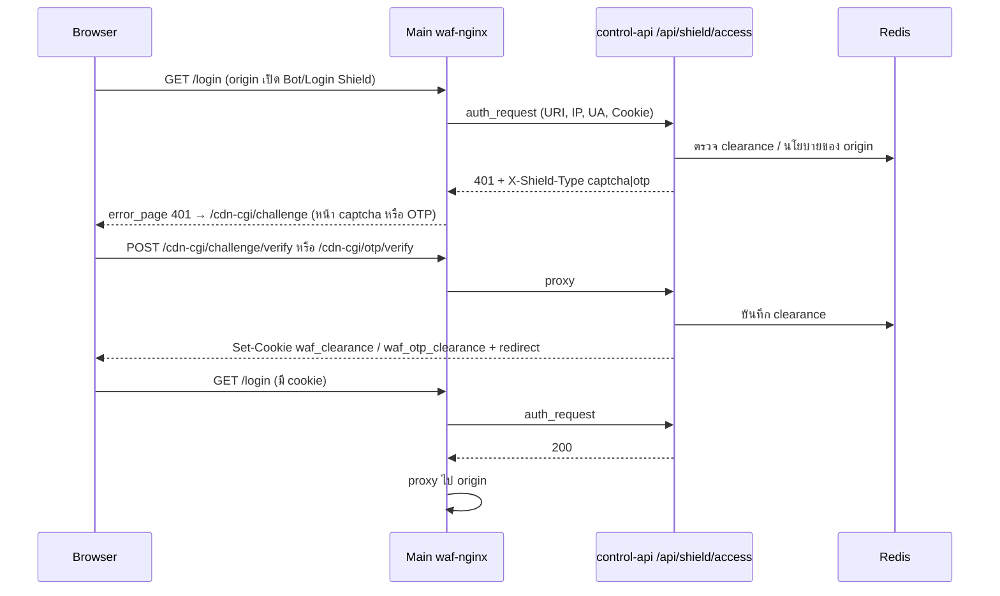

# Flow C — Challenge (Captcha / OTP)

*รูปที่ 11 — Challenge ด้วย captcha หรือ OTP*

## กลไก

- ทุก `location /` บน Main มี `auth_request /internal-shield-check` → control-api `/api/shield/access` ตัดสินรวม captcha + OTP (+ rate limit ผ่าน `/internal-rate-limit`)
- ถ้าต้อง challenge คืน 401 พร้อม `X-Shield-Type` → nginx `error_page 401 = /cdn-cgi/challenge` (จาก `nginx/includes/captcha_server.conf`) → หน้า captcha หรือ OTP
- ผ่านแล้วได้ cookie `waf_clearance` (captcha) หรือ `waf_otp_clearance` (OTP) และ edge ไม่ cache คำขอที่มี cookie เหล่านี้
- กฎ WAF action **CHALLENGE** (`deny,status:401`) ใช้เส้นทางเดียวกัน

## สถานะ/ข้อควรรู้

- OTP ทางอีเมลต้องตั้งค่า SMTP (ค่าเริ่มต้นว่าง) → OTP ทางอีเมล UNKNOWN
- ใน server block เดียวกันมี `error_page 401` สองรายการ (challenge จาก include และ `=429 @rate_limit_exceeded`) ควรทดสอบพฤติกรรมจริงของกรณี rate limit บน Main อีกครั้ง → PARTIAL

## แหล่งอ้างอิง (Evidence)
- `nginx/includes/otp_server.conf`, `captcha_server.conf`, `nginx/templates/conf.d/default.conf.template:68–99`, `cdn/control-api/main.py:110–150`, `otp_engine.py`, `captcha_engine.py`
