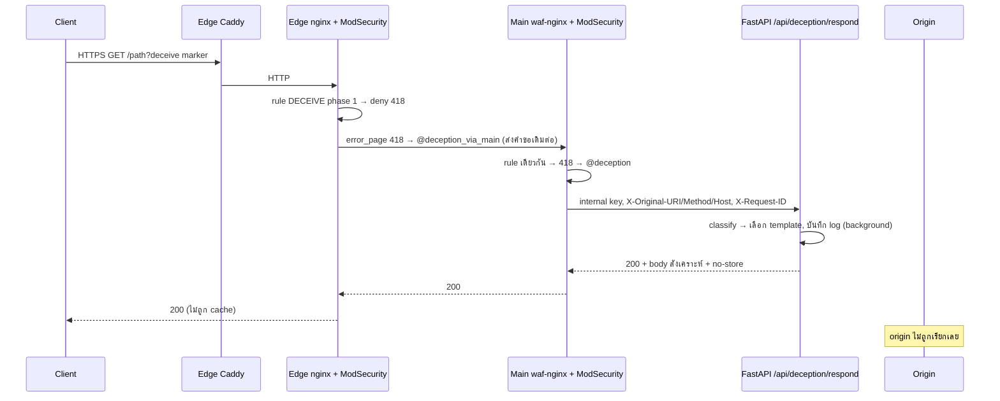

# Flow D — Deception



*รูปที่ 12 — คำขอที่เข้า deception*

```text
Client → Edge → WAF (กฎ DECEIVE, phase 1, 418) → Main → Deception layer → Synthetic response → Client
```

**ยืนยันว่า origin ไม่ถูกติดต่อ:** `@deception` และ `@deception_via_main` proxy ไปเฉพาะ FastAPI/Main ไม่มี upstream ของ origin; ทดสอบจริงได้ 200 + body สังเคราะห์ + `no-store` และ edge ไม่ใส่ `X-Cache-Status` (ไม่ผ่าน cache)

รายละเอียด: บทที่ 17

## แหล่งอ้างอิง (Evidence)
- smoke test 2026-09-27 (11/11 ผ่าน), template ของ Main และ edge
