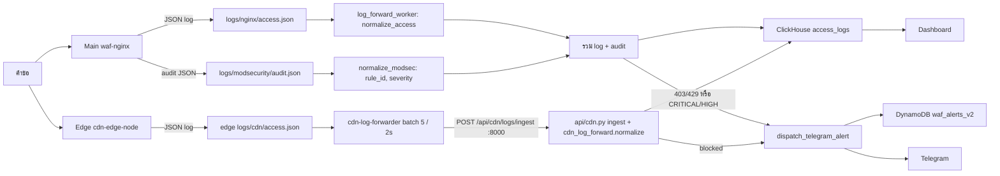

# Flow E — Logging

```mermaid
flowchart LR
  req["คำขอ"] --> mn["Main waf-nginx"]
  req --> en["Edge cdn-edge-node"]
  mn -->|JSON log| f1["logs/nginx/access.json"]
  mn -->|audit JSON| f2["logs/modsecurity/audit.json"]
  en -->|JSON log| f3["edge logs/cdn/access.json"]
  f3 --> fwd["cdn-log-forwarder batch 5 / 2s"]
  fwd -->|POST /api/cdn/logs/ingest :8000| ingest["api/cdn.py ingest + cdn_log_forward.normalize"]
  f1 --> lfw["log_forward_worker: normalize_access"]
  f2 --> lfw2["normalize_modsec: rule_id, severity"]
  lfw --> merge["รวม log + audit"]
  lfw2 --> merge
  merge --> ch["ClickHouse access_logs"]
  ingest --> ch
  merge -->|403/429 หรือ CRITICAL/HIGH| alert["dispatch_telegram_alert"]
  ingest -->|blocked| alert
  alert --> ddb["DynamoDB waf_alerts_v2"]
  alert --> tg["Telegram"]
  ch --> dash["Dashboard"]
```

*รูปที่ 13 — log จากคำขอถึงที่จัดเก็บ*

รายละเอียดฟิลด์และการแปลง: บทที่ 14

## แหล่งอ้างอิง (Evidence)
- `services/log_forward.py`, `services/cdn_log_forward.py`, `api/cdn.py`
