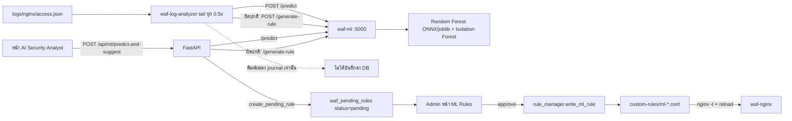

# Flow F — Machine Learning



*รูปที่ 14 — ML จาก log ถึงการอัปเดตกฎ*

```text
Logs → ML (/predict) → Detection (is_anomaly, attack_probability) → Recommendation (/generate-rule)
     → [บันทึกเฉพาะเส้นทาง AI Security Analyst] → waf_pending_rules → Admin review → ml-<id>.conf → reload
```

ข้อสำคัญ: เส้นทางอัตโนมัติจาก log analyzer ยังไม่บันทึกกฎรออนุมัติ (บทที่ 16)

## แหล่งอ้างอิง (Evidence)
- `ml/async_log_analyzer.py`, `dashboard/backend/api/ml.py:174`, `services/ml_rule_service.py`
