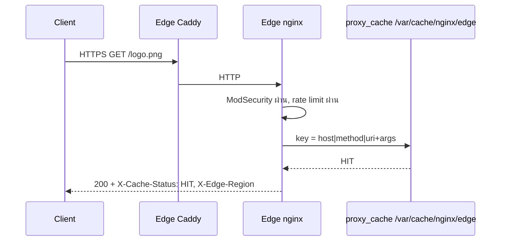
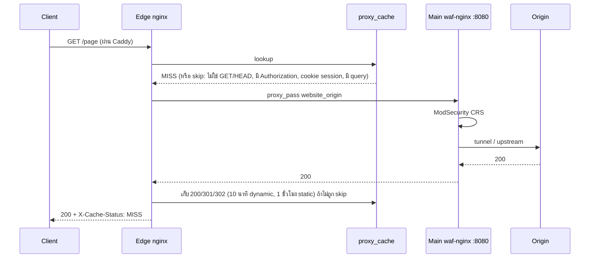

# Flow G — CDN (Cache Hit / Miss)

*รูปที่ 16 — Cache hit*

*รูปที่ 17 — Cache miss*

- ตรวจสถานะได้จาก header `X-Cache-Status` (HIT / MISS / BYPASS / EXPIRED …) และ `X-Edge-Region`
- ทดสอบจริง: `robots.txt` ของ dvwa และ juice ได้เนื้อหาของใครของมัน คำขอที่สองเป็น HIT ต่อ host (cache key มี `$host`)

## แหล่งอ้างอิง (Evidence)
- บทที่ 24, ผลตรวจของ tester 2026-09-27
